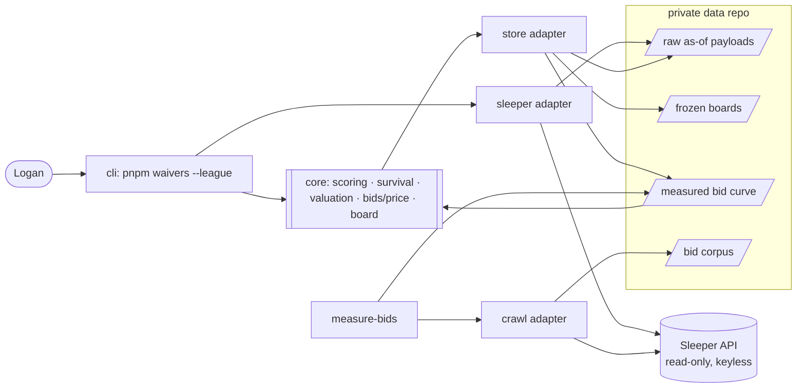
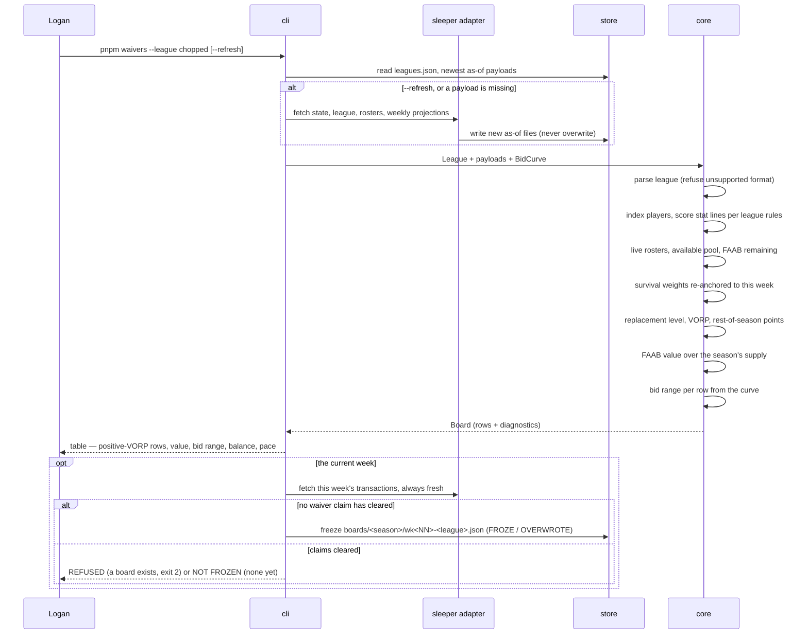

# ff-assistant-reboot — Architecture

<!-- Written by project-kickoff, Phase 4. Read before adding a module, changing a boundary, or when the user asks how data moves. Keep the module map and sequence diagrams true; /wrap checks them when a slice lands. -->

## Module map

| Module | Owns | Receives | Emits |
|---|---|---|---|
| `sleeper/` | Every HTTP call to Sleeper, Zod-parsed at the boundary; writes each response as an as-of file | Request parameters, the data root | Typed payloads (league, rosters, transactions, projections, player map) |
| `crawl/` | Discovering public guillotine rooms and pulling their transactions, throttled | A starting league, limits | Raw crawled rooms and claims |
| `store/` | Data-root paths, as-of file naming, reading and writing boards and curves | Paths, artifacts | Typed artifacts, `schemaVersion` enforced |
| `config/` | Deriving a `League` from its own payload; **refusing an unsupported format by name** | Raw league payload, `leagues.json` | `League`, or a loud refusal |
| `players/` | The player index (players Sleeper calls active, admitted on eligible fantasy positions) and name/ID matching; loud unmatched logging | Player map, external name rows | `PlayerIndex`, match results |
| `scoring/` | Scoring one stat line under one league's rules | Stat line, `League` | Points |
| `rosters/` | Who is live vs. chopped, FAAB remaining per roster, and the available pool as the observed complement of rostered players | Roster payloads, `PlayerIndex` | `LeagueState` |
| `survival/` | P(alive at week w), re-anchored to the current week | Live team count, weeks remaining, chop cadence | Weekly weights |
| `valuation/` | Replacement level, VORP, rest-of-season points, and the FAAB allocation over the season's supply | Weekly points, `LeagueState`, weights | Priced rows |
| `bids/measure/` | Turning the crawl corpus into a measured `BidCurve`; runs offline and rarely | Bid observations, historical projections | `BidCurve` artifact |
| `bids/price/` | Mapping a row's quality to a bid range from the curve | `BidCurve`, priced rows | Ranges |
| `board/` (core) | Assembling rows and diagnostics into a `Board`; the artifact's schema and the identity it must close | Priced rows, ranges, `LeagueState` | `Board` artifact |
| `claims/` | Whether a week's waiver claims have already run, from observed transactions only | That week's transactions | Cleared or not |
| `board/` (adapter) | Freezing: only the current week, and nothing once that week's claims have cleared | `Board`, the store, a fresh transactions fetch | What happened — froze, overwrote, past week, or cleared |
| `cli/` | Flags, orchestration, table rendering, exit codes | argv | Terminal output |
| `obs/` | Structured logging and the debug trace | Events from every module | stderr |

**Source layout.** The boundary is a directory, so the rule is greppable and
enforceable: `src/core/**` (scoring, survival, valuation, bids/price, board, claims,
and the pure parts of config, players, rosters) and `src/adapters/**` (sleeper, crawl,
store, board, cli, obs). Ports are declared in `src/core/ports.ts`.

## Containers



## Sequences

### When Logan runs the Tuesday board



### When the bid curve is measured (offline, occasional)

```mermaid
sequenceDiagram
    participant U as Logan
    participant CLI as cli
    participant CR as crawl adapter
    participant ST as store
    participant M as bids/measure
    U->>CLI: pnpm measure-bids --season 2025
    CLI->>CR: discover guillotine rooms, pull transactions
    CR->>ST: write raw rooms + claims (resumable; only what is missing)
    CLI->>M: corpus + historical weekly projections
    M->>M: normalize each bid by its own room's budget
    M->>M: score the player as of that week, band by quality
    M->>M: percentiles per band; winner vs. runner-up spread
    M-->>CLI: BidCurve + provenance (sample size, rooms, caveats)
    CLI->>ST: write measured/bid-curve-v<N>.json
    CLI-->>U: summary for review — nothing prices until Logan accepts it
```

### When a league Logan adds is not supported

```mermaid
sequenceDiagram
    participant U as Logan
    participant CLI as cli
    participant SL as sleeper adapter
    participant CF as config
    U->>CLI: pnpm waivers --league <new>
    CLI->>SL: fetch that league's settings
    SL->>CF: raw payload
    CF->>CF: parse: roster slots, scoring, waiver type, format
    CF-->>CLI: refusal — "starts 2 QB + superflex; not supported"
    CLI-->>U: named reason, exit non-zero, no board written
```

## Core and adapters

- **Core:** `scoring/`, `survival/`, `valuation/`, `bids/price/`, `board/`, and the pure
  parts of `config/`, `players/`, `rosters/` — the logic. **No `fetch`, no `node:fs`,
  no clock, no `process.env`.** It receives plain data and returns plain data.
- **Ports (interfaces the core defines):**
  - `PayloadSource` — "give me the league, rosters, transactions, projections for week N"
  - `ArtifactStore` — "read/write a board or a curve"
  - `Logger` — structured events
- **Adapters (implementations):**
  - `sleeper/` → `PayloadSource` (HTTP + Zod + as-of files)
  - `store/` → `ArtifactStore` (filesystem, data root)
  - `crawl/` → `PayloadSource` for other rooms (HTTP, throttled)
  - `cli/` → the entry point (argv, rendering)
  - `obs/` → `Logger`

Rule: nothing outside the core imports from inside it except through a port; nothing
inside the core imports an adapter.

**Why this pattern here.** Ports and adapters buys three specific things: pricing is
testable with no network and no database; a UI or any second interface later is an
adapter, not a rewrite; and determinism becomes structural rather than aspirational —
a core with no clock and no I/O *cannot* return different numbers on a rerun.

**It is enforced mechanically.** dependency-cruiser fails the check if anything in the
core imports `node:fs`, `node:http`, `fetch`, or an adapter module. An architecture
rule that only lives in a document is one that erodes; this one is a check.

## Interfaces

- **Primary interface, day one:** a CLI.

  ```
  pnpm waivers --league chopped      # one league per invocation; --league is required
  pnpm waivers --league chopped --week 3
  pnpm waivers --league chopped --refresh   # fetch fresh data, writing new as-of files
  pnpm waivers --league chopped --all       # every available player, not only positive VORP
  pnpm waivers --league chopped --debug     # the data path, stage by stage
  pnpm measure-bids --season 2025           # offline: crawl → reviewed curve artifact
  pnpm fixtures                             # regenerate scrubbed test fixtures
  ```

  `--league` is required and an unknown value lists the configured leagues. One league
  per run keeps each invocation's output, exit code, and frozen artifact about exactly
  one league.

- **UI plan:** the frozen board artifact **is** the UI port — one complete league-week
  per file, written on every run, containing everything a page would show. A UI would
  render a board with sortable columns and the diagnostics that do not fit a terminal
  table (FAAB pool, season supply, spend pace against the typical curve), reading
  `ArtifactStore` and touching no pricing code. It must stay local or private, since it
  shows league data.

  Status: **planned only, not built in v1.** The 2026 UI was cut because it was a layer
  on top of numbers Logan did not yet trust. Trust comes first: use the terminal board
  for two or three real Tuesdays, then decide. The artifact port keeps it cheap
  whenever that is.

## Observability

- **Logging:** structured JSON lines to stderr (the table goes to stdout, so piping
  stays clean). Hand-rolled over `console.error` — no logging dependency for a CLI this
  size.
- **Debug mode:** `--debug` traces the data path in the same order as the sequence
  above: players indexed; projection rows matched and unmatched; rosters live vs.
  chopped; available pool size; replacement level per position; FAAB pool, chops
  remaining, season supply, dollars per VORP; rows kept vs. dropped with the dropped
  value accounted for.
- **Always loud, at any verbosity:** unmatched players, a player skipped as inactive who
  still carries projected points, a refused league format, a board that fails its
  closed-economy assertion, and a curve older than the season it is pricing.

## Build order

Vertical slices, thin and end to end. Never a full layer before the next slice.

1. **Walking skeleton:** chopped league, one week — fetch → config → player index →
   weekly projections → local scoring → replacement/VORP → FAAB value → printed table.
   Tested against scrubbed fixtures, with a determinism test. Running on Logan's Mac.
2. **Freeze and prove:** the `Board` artifact with `schemaVersion` and diagnostics; the
   one-time parity check against the archived 2026 week-2 board; our own board pinned
   as the golden test.
3. **Standard league:** the same board minus every dollar column. Proves the format
   difference is a seam and not a fork.
4. **Crawl and measure:** the bid corpus and the `BidCurve` artifact, with provenance,
   reviewed by Logan before it prices anything.
5. **Bid range, Logan's balance, and the room's spend pace** — the last on trial, kept
   or cut after a few real Tuesdays.

Slices 1–3 are what must land for the week-3 board. 4 and 5 follow as soon as they are
right, not as soon as they run.

## Generated graph

`pnpm graph` writes the real import graph to `docs/graph.md` via dependency-cruiser.
The diagrams above are intent; that one is truth. When they disagree, one of them is a
finding — and the core-purity rule is a dependency-cruiser rule, so a violation fails
the check rather than waiting to be noticed.
