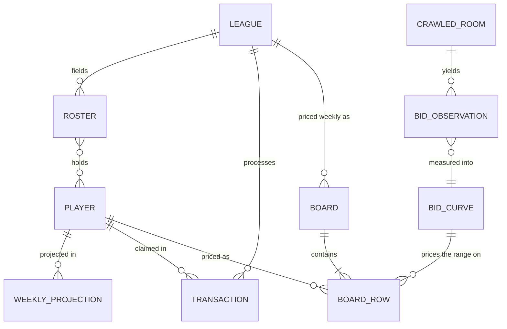

# ff-assistant-reboot — Data and state

<!-- Written by project-kickoff, Phase 3. Read when touching persistence, schema, fixtures, or anything that stores state. -->

There is no database. All state is files: payloads that arrived from outside, and
artifacts we deliberately froze. Everything else is recomputed on every run.

## Entities



| Entity | Purpose | Key fields |
|---|---|---|
| `LEAGUE` | One Sleeper league's settings, parsed from its own payload — never assumed, never hardcoded | `leagueId`, `season`, `teams`, `budget`, `rosterPositions`, `scoring`, `waiverType`, `faabBudget`, `faabMinBid`, `format` (guillotine / standard) |
| `PLAYER` | Sleeper's player record | `playerId`, `name`, `team`, `fantasyPositions`, `injuryStatus` |
| `WEEKLY_PROJECTION` | One player's raw stat line for one week. Scored locally per league; pre-scored points are never ingested | `playerId`, `season`, `week`, `stats{}`, `games` |
| `ROSTER` | One team in a league | `rosterId`, `ownerId`, `players[]`, `reserve[]`, `faabUsed`, `eliminated` |
| `TRANSACTION` | A waiver claim in one of Logan's leagues, won or failed | `week`, `playerId`, `rosterId`, `bid`, `status` |
| `CRAWLED_ROOM` | A public guillotine league found by the crawl, with the settings needed to normalize its bids | `leagueId`, `season`, `teams`, `faabBudget`, `chopCadence`, `status` |
| `BID_OBSERVATION` | One claim from a crawled room, normalized as a share of that room's budget | `leagueId`, `week`, `playerId`, `bidShare`, `won`, `quality` |
| `BID_CURVE` | The measured artifact: what share of a budget a player of a given quality goes for, as a distribution | `version`, `measuredAt`, `sampleSize`, `tiers[] { qualityBand, p25, p50, p75 }`, `provenance` |
| `BOARD_ROW` | One available player, priced | `playerId`, `position`, `points`, `vorp`, `value`, `bidRange{low,high}`, `flags[]` |
| `BOARD` | A league-week's rows plus diagnostics, frozen to disk | `leagueKey` (never the Sleeper league ID), `season`, `week`, `generatedAt`, `schemaVersion`, `inputs[]` (the as-of files it read), `diagnostics` (incl. `economy`, `dropped{rowCount,valueSum}`), `rows[]` |

`quality` on a `BID_OBSERVATION` is the open question Phase 4 has to settle: it needs
a measure of how good a player looked **at the moment of the bid**, which requires
historical weekly projections. If Sleeper no longer serves 2025 weekly projections,
the fallback is the player's rank among that week's winning bids in his own room —
weaker, but computable from the transactions alone.

## Stored vs derived

**The rule: store only what came from outside, plus artifacts we deliberately freeze.
Nothing derived is ever read back as an input.**

| Data | Stored or derived | Derived from | Why |
|---|---|---|---|
| Raw Sleeper payloads (league, rosters, transactions, projections, player map) | **Stored**, immutable, as-of | — | Came from outside. Keeping the payload is what makes a past run reproducible |
| Crawl corpus (`CRAWLED_ROOM`, `BID_OBSERVATION`) | **Stored** | Crawled payloads | Expensive to re-collect (~1,500 calls); the raw rooms are kept so the normalization can be recomputed without re-crawling |
| League config | Derived, every run | Raw league payload | Deriving it means it can never drift from Sleeper. The 2026 tool's worst data bug was a committed config that said 18 teams after the room dropped to 16 |
| Scored fantasy points | Derived, every run | Stat lines × that league's scoring | Two leagues score the same stat line differently (6-pt pass TD, −1 vs −2 INT) |
| Replacement level, VORP | Derived, every run | Scored points + roster shape + live team count | Cheap, and it changes every week as teams are chopped |
| Value (FAAB dollars) | Derived, every run | VORP + remaining FAAB + chops remaining | — |
| Available pool | Derived, every run | Player map minus the union of live rosters | Sleeper permits over-roster states, so it is always the observed complement, never `teams × rosterSize` |
| **`BID_CURVE`** | **Derived, then stored** | `BID_OBSERVATION`s | Measuring is expensive and Logan reviews it before it prices anything. Each measurement is a new versioned file; invalidated by measuring again, never edited in place |
| **`BOARD`** | **Derived, then stored** | Everything above | A Tuesday decision must be reproducible afterwards. It is a **record, not an input**: no code path reads a frozen board to price a later week |

## No TTL: immutable as-of snapshots

The 2026 tool cached every source with a 24-hour expiry, so a rerun a day later
silently refetched and the numbers moved. Measuring a code change meant freezing the
clock first.

**This project has no TTL.** The rules:

1. A fetch writes a **new** file stamped with the date it was fetched. Nothing is
   overwritten.
2. If a file for the requested `(source, season, week)` exists, it is used.
3. Fresh data is an explicit `--refresh`, which writes another as-of file.
4. Every stored payload records `fetchedAt` and the request URL.
5. Therefore: two runs over the same files produce identical output, with no clock
   read anywhere in the pipeline.

This is the **immutable as-of snapshot** pattern — keep what arrived, recompute the
rest. It is also what makes the determinism test meaningful rather than luck.

## Schema and migrations

- **Where the schema lives:** Zod schemas in the code. Inbound schemas validate
  Sleeper payloads at the boundary; outbound schemas validate every artifact we write.
- **Versioning:** every written artifact carries `schemaVersion`. A reader that meets
  an unknown version **refuses loudly** — it never guesses or partially parses.
- **Migration tool:** none. Past weeks are immutable, so there is nothing to migrate.
  A shape change bumps the version and applies to new files only.
- **Who runs it:** nobody. There is no migration step.
- **Unsupported leagues fail here.** Parsing the league payload is also the gate: a
  format we do not model (superflex, IDP, DST slots, best-ball, dynasty, a guillotine
  cadence unlike Logan's) is rejected at validation with a named reason. A quiet wrong
  price is the failure mode this exists to prevent.

## Fixtures and seed data

- **Tests run against** trimmed real payloads on disk — no network, no test database.
  Real payloads because every expensive lesson of 2026 came from the feed's actual
  shape: bye weeks arrive with no `gp` field at all, chopped rosters come back with
  `eliminated: 1` and `players: null`, and two rosters held 15 players against a
  14-slot shape.
- **Fixtures live at** `test/fixtures/` in the public repo.
- **Regenerate with** `pnpm fixtures` — a script that reads the private data repo,
  trims payloads to a handful of players and rosters, and **scrubs identities**.
- **Scrubbing is mandatory, because fixtures are public.** Owner IDs and Sleeper
  display names are replaced with stable fakes (`owner_001`); league IDs are replaced
  with fake IDs. NFL player names and IDs stay — those are public figures, and the
  name-matching tests are worthless without real names.
- **A privacy scan runs in the check command** and fails it if a real Sleeper handle,
  owner ID, or league ID appears in any tracked file. gitleaks catches credentials; it
  does not catch a leaguemate's handle, so this is its own check.
- **Golden tests:** the archived 2026 week-2 board is used **once**, as a parity check
  that the value column reproduces the old tool's numbers (same math, so it should).
  It is then retired. The permanent golden is **our own** first board — pinning the old
  tool's output would freeze its bugs, including a `market` column that turned out to
  be 100% floor defaults.

## File state

| State | Shape | Read by | Written by |
|---|---|---|---|
| `leagues.json` | Which leagues to run, by ID and key. Lives in the **private** data repo, so no league ID enters the public one | Config loader | Logan, by hand |
| `raw/<season>/*.json` | As-of Sleeper payloads: player map, league, rosters, transactions, weekly projections | Loaders (one per source) | Fetchers, on `--refresh` or first run |
| `boards/<season>/wk<NN>-<league>.json` | Frozen board: envelope + diagnostics + rows | Nothing in the pipeline. Logan, and future analysis | The waiver stage, once per league-week |
| `bids/<season>/*` | Crawl corpus: rooms and their normalized bids | The measurement step | The crawler |
| `measured/bid-curve-v<N>.json` | The reviewed bid curve | The pricing step | The measurement step, on demand |
| `measured/chop-unspent-v1.json` | The reviewed unspent curve: share of a budget that leaves with a team chopped in each week, and the survivor's residual. Raw rows and the analysis script beside it | The pricing step, guillotine FAAB rooms only (tickets/007); refused without `reviewed: { by, on }` | The one-off 2025 crawl; accepted by Logan |
| `archive/` | The 2026 carryover, with its own README of verified caveats | Humans, and one-time parity checks | Nothing — frozen |

Layout in the private repo:

```
ff-assistant-data/
  leagues.json
  raw/2026/players-nfl-<date>.json
  raw/2026/league-<id>-<date>.json
  raw/2026/rosters-<id>-wk<NN>.json
  raw/2026/transactions-<id>-wk<NN>.json
  raw/2026/projections-wk<NN>.json
  boards/2026/wk<NN>-<league>.json
  bids/2025/…
  measured/bid-curve-v1.json
  measured/chop-unspent-v1.json    (+ -rows.csv, -analyze.mjs)
  archive/…
```

**Retention:** every weekly payload is kept (~2 MB a week, ~40 MB a season) — that is
what makes any week reproducible. Player maps are kept one per pull date, and pruned
when no frozen board references them.
